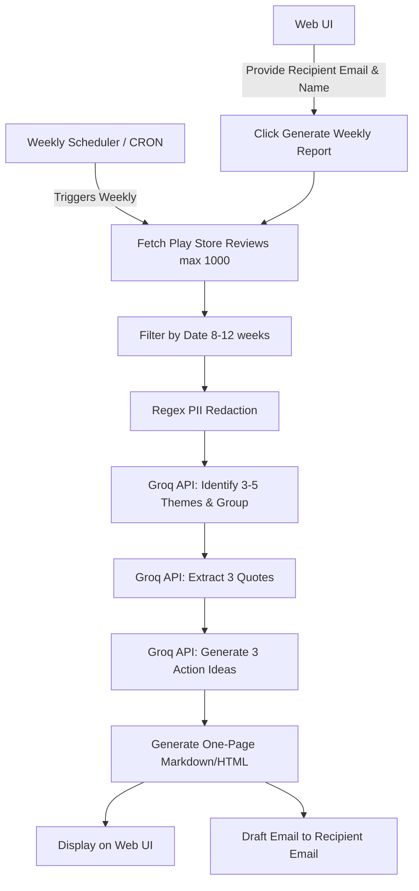

# Groww Weekly Reviews Pulse - Architecture Document

## Overview
A system to automatically extract recent (8-12 weeks, up to 1000) Play Store reviews for Groww, use Groq's LLM to distill them into top themes, actionable ideas, and user quotes, and finally draft a one-page weekly pulse email. This system will be driven by a Web UI for triggering the report generation and viewing the output.

## Persona & Value Proposition
- **Product/Growth Teams:** Understand what features or fixes to prioritize next.
- **Support Teams:** Observe user sentiment and specific pain points.
- **Leadership:** Get a quick, high-level health pulse of the app.

## System Architecture

The project is structured into 6 sequential phases, designed as a data pipeline accessible via a web interface and automated via a scheduler.

### Phase 1: Data Ingestion (Scraping)
- **Objective:** Fetch reviews from the last 8-12 weeks from the Google Play Store (capped at 1000 reviews).
- **Tools:** `google-play-scraper`.
- **Process:** 
  1. Calculate the date range (Current Date - 12 weeks).
  2. Query the Play Store for the Groww app.
  3. Filter reviews strictly by the date range and limit to a maximum of 1000 reviews.
  4. Standardize data format: `{ "source": "Play Store", "date": "...", "rating": 5, "title": "...", "text": "..." }`.

### Phase 2: Data Pre-processing & PII Removal
- **Objective:** Sanitize the data before sending it to the LLM.
- **Requirements:** MUST NOT include any Personally Identifiable Information (PII) in reports or LLM prompts if possible.
- **Process:**
  1. Basic regex-based filtering for phone numbers, emails, etc.
  2. We rely on the LLM to identify and remove or redact any remaining PII during the summarization phase, explicitly instructing it not to output PII.

### Phase 3: Core LLM Processing (via Groq API)
- **Objective:** Generate insights, themes, and actions.
- **Model:** Prompting via Groq (e.g., Llama 3 family) for high speed and reasoning capabilities.
- **Prompt Strategy (Sequential or Structured output):**
  1. **Theme Generation:** Pass batched reviews to the LLM. Ask it to identify exactly 3-5 macro themes (e.g., "Login Issues", "Great UI", "Mutual Fund Sync Errors").
  2. **Review Grouping & Quote Extraction:** For the top 3 themes, ask the LLM to select 1 representative, highly impactful user quote each (total 3 quotes). Ensure quotes are anonymized.
  3. **Actionable Ideas Generation:** Based on the themes and negative reviews, ask the LLM to propose 3 concrete action ideas for the Product/Growth teams.

### Phase 4: Formatting & Email Drafting
- **Objective:** Combine the processed data into a single-page document and draft a weekly email.
- **Process:**
  1. **Template Engine:** Compile the LLM outputs (Themes, Quotes, Actions) into a clean Markdown or HTML template.
  2. **Email Integration:** Connect to an email service (e.g., standard SMTP or generate an `.eml` file / `mailto:` link) to create a draft email addressed to a recipient email parameter (passed from the UI/Scheduler). The email body will start with "Hi, [Recipient Name]" followed by the rest of the email content.

### Phase 5: Web UI Layer
- **Objective:** Provide a graphical user interface to trigger the new weekly report generation, view the results, and configure reports.
- **Process:**
  1. Build a simple web dashboard (e.g., using Streamlit or a basic frontend).
  2. Add input fields for the "Recipient Email Address" and "Recipient Name".
  3. Add a "Generate Weekly Pulse" button to trigger the pipeline (Phases 1-4).
  3. Display the generated one-page Markdown/HTML directly on the UI prior to explicitly sending/saving the email draft.

### Phase 6: Automation & Scheduling
- **Objective:** Ensure the report is generated and the draft email is created automatically every week without manual intervention.
- **Process:**
  1. Implement a scheduler (e.g., cron job, GitHub Actions, or Python `schedule` library).
  2. Configure the scheduler to run the core pipeline (Phases 1-4) once a week (e.g., every Monday at 9:00 AM).

## Technology Stack
- **Language:** Python 3.10+
- **LLM Provider:** Groq API (using models like `llama3-70b-8192` or `llama3-8b-8192`)
- **Libraries:**
  - `google-play-scraper`
  - `groq` (Official Python SDK)
  - `pydantic` (For structured LLM outputs if using function calling / JSON mode)
  - `streamlit` or `flask`/`fastapi` (For the Web UI)
  - `schedule` or `APScheduler` (For the automation script)
  - `jinja2` (For report formatting - Optional)

## Execution Flow

## Next Steps
1. Setup Python project and virtual environment.
2. Build the scraper for Google Play Store (with 1000 review limit).
3. Integrate Groq API and fine-tune the prompts.
4. Build the email drafting module, Web UI, and weekly scheduler.
